# Virtual Home User Guide
{:.no_toc}

1. TOC
{:toc}

Download a [PDF version](vh-user-guide-v3.pdf) of this guide.

## What is this tool?

The Virtual Home (VH) enables small organisations, including collaborative research facilities, to manage user identities for international, government, and industry based researchers. The VH replaces older software (the VHO) and has been developed by the Australian Access Federation. The VH uses new technology, and is based on real requirements and use cases.  
As a researcher or end user, you generally wouldn't log into the VH unless you need to change your password or find administrator contact details. Usually you'll just select "Tuakiri Virtual Home" when logging into the particular Service you intend to access.  
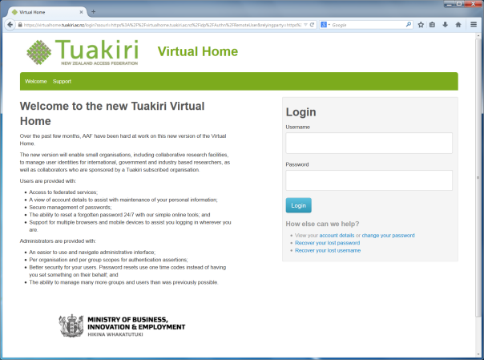

## How do I get a Tuakiri VH account?

The authority to create an account on the Tuakiri VH is delegated to the subscriber organisations of Tuakiri. If you are a student, staff member or collaborator of a Tuakiri subscriber organisation, and you think your work could benefit from having an account on the Tuakiri VH, then please contact your identity provider administrator to discuss this option.  
For a list of organisations subscribed to Tuakiri, view the [subscriber list](https://reannz.atlassian.net/wiki/spaces/Tuakiri/pages/3815539864/Subscriber+List) online. To find your identity provider administrator, contact your local service desk. If you have any issues, please contact us at [support@tuakiri.ac.nz](mailto:support@tuakiri.ac.nz).  
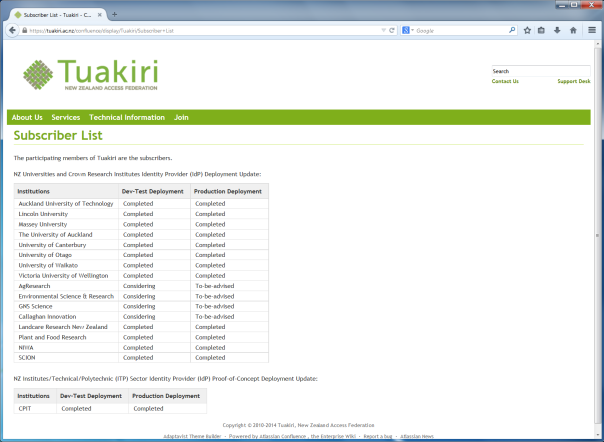

## How do I set up my new account?

When your administrator creates an account for you, you'll receive an email and an invitation link to finish setting up your account. Here you will choose a username, enter your password and mobile number.  
Please note the password requirements on the right hand side. Your mobile number is required if you ever need to reset your password (i.e. if it's forgotten).  
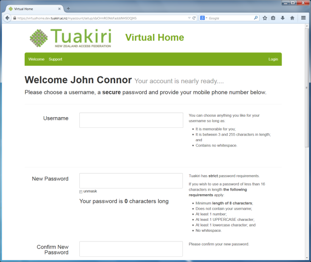

## How do I reset my password?

You'll find the "recover your lost password" link on the login page. This will begin the process to choose a new password. You'll need your mobile and email account on hand to enter the SMS or email codes we'll send you.  
You'll have to enter a new password to comply with the minimum password requirements. These are listed on the right hand side. We recommend you use a password with more than 16 characters. For example, "iWonOnAHorseinthemelbournecupin2011" satisfies the password requirements and is extremely secure (providing you keep it a secret!).  
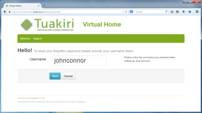  
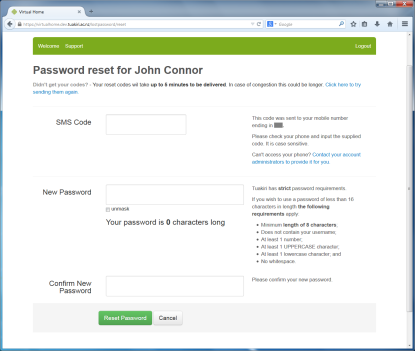

## How do I change my password?

Use your VH account to log in to [https://virtualhome.tuakiri.ac.nz/myaccount](https://virtualhome.tuakiri.ac.nz/myaccount) and you can use the 'Change password or mobile number' button to begin the process.  
Ensure you read the password requirements on the right hand side of the page. We strongly recommend you use a secure password with more than 16 characters.  
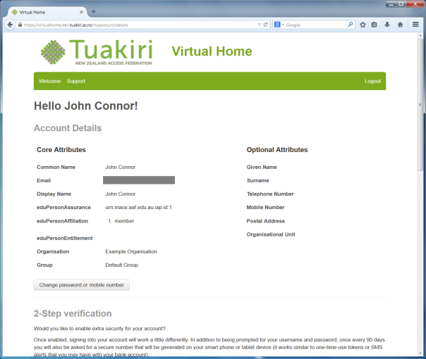

## How do I change my account details?

Your account details can only be changed by the administrator of the organisation. You'll find their contact details after logging into [https://virtualhome.tuakiri.ac.nz/myaccount](https://virtualhome.tuakiri.ac.nz/myaccount) and scrolling to the bottom of the page.  
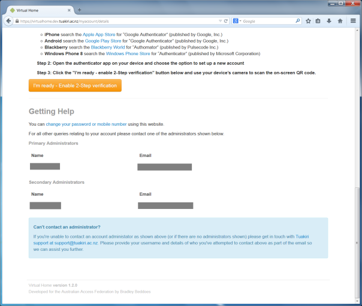

## How do I use 2-step verification?

(Note: you must have set up your account and set up an app on your mobile device, in order to use 2-step verification. To set this up, log in to the Tuakiri VH, and follow the instructions shown on the landing page.)  
Log in to the Tuakiri VH using your VH account. Enter your username and password, and click Login. Then you will see a screen as shown below:  
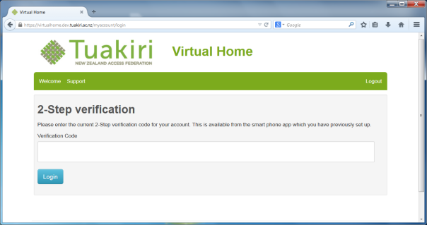  
Check your device for the verification code. Enter the code and click Login.  
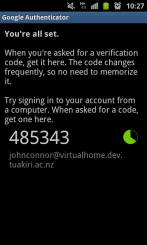 (This screenshot is of an Android device, using the Google Authenticator.)  
  

## How do I log in to services using my account?

Find the service you wish to log in to and, provided the service is connected to Tuakiri, you will be able to select "Tuakiri Virtual Home" from the Organisation list. Click Select, and enter your username and password to log in to that service.  
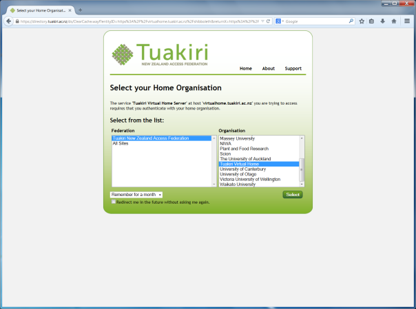

## Why is my account locked out?

In case you enter an incorrect password, you may attempt to login to the VH up to five times. After five failed login attempts, your account will be locked out. If your account is locked out, you will receive a notification email informing you about this. To unlock your account, please contact Tuakiri support at [support@tuakiri.ac.nz](mailto:support@tuakiri.ac.nz).  
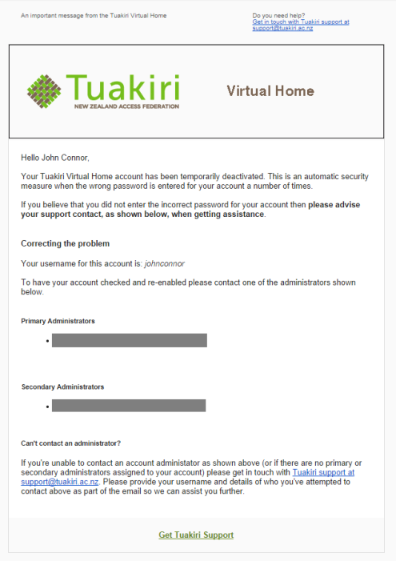

## Where can I find more help?

Contact Tuakiri support on [support@tuakiri.ac.nz](mailto:support@tuakiri.ac.nz.).
